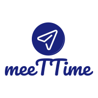

# meeTTime

## Table of Contents
1. [Overview](#Overview)
1. [Product Spec](#Product-Spec)
1. [Initial Wireframes](#Initial-Wireframes)
2. [Demo](#Demo)

## Overview
### Description
This application's finality is personal scheduling. Users can launch and join meetings with friends and family. The app finds users the best hour to join meetings based on their availability settings and that of other users.

### App Evaluation
- **Category:** Lifestyle/Utility
- **Mobile:** Portability
- **Story:** Encouraging real-life social interactions and meetings among friends and family.
- **Market:** All android users could use this app, especially not to fill their professional calendars with their casual appointments.
- **Habit:** A utility app. To be used when needed. It can be addictive in the sense that users will be curious to see what events their friends are joining ( assuming the timeline activity will display that information/ similar to VENMO's timeline).
- **Scope:** Feasible depending on the complexity of finding the time that works for all 'attendees'.

## Product Spec

### 1. User Stories (Required and Optional)

**Required Must-have Stories**

* User can login/sign-up.
* User can create a profile.
* User can launch an event.
    * User can chose to launch an 'open' meeting; i.e an algorithm will keep recalculating the closest time that works for all attendees every time another user joins the event.
* User can join a launched event.
* User can search for other users.
* User can view other users' profiles.
* User can follow other users.
* User has access to a stream screen of updates of all users they follow (ex: "Zaynab launched event x." |"Helen joined event Y.")
* User can edit their availability. 
  * There can be a calendar view to achieve this story.
 * User can like updates/join events from their timeline.
* User can use camera to set/change profile picture or set/change event picture.
* Users can view meeting location on the map and get a trajectory from their current location.
* Users can see all the events they joined and launched in a calendar.

### 2. Screen Archetypes

* Login Screen
   * User can login
 * Sign-up screen
   * User can sign-up
 * Profile creation/editing screen
    * User can edit their profile
    * Availability can also be edited from here
* Stream
   * User can view updates on other users (i.e user X joined/launched meeting...)
   * User can join meetings from stream (if allowed by launcher)
   * User can like an update
* Creation
   * User can launch a meeting
   * User can invite other users 
   * User customizes the settings for the meeting (i.e details of the event)
* Search
    * User can search for other users
    * User can follow other usesr
* Profile Screen
    * User can see own history of scheduling
    * User can see other users' history of scheduling
    * 
* Calendar
    * Users can see events they launched/joined.
* Event description Screen
    * will include info regarding event launched including attendees, a text description, time, location (mapView) and a list of attendees, as well as a schedule that shows the best hour for attendees to meet (based on the algorithm computation).

## Initial Wireframes

## Demo

