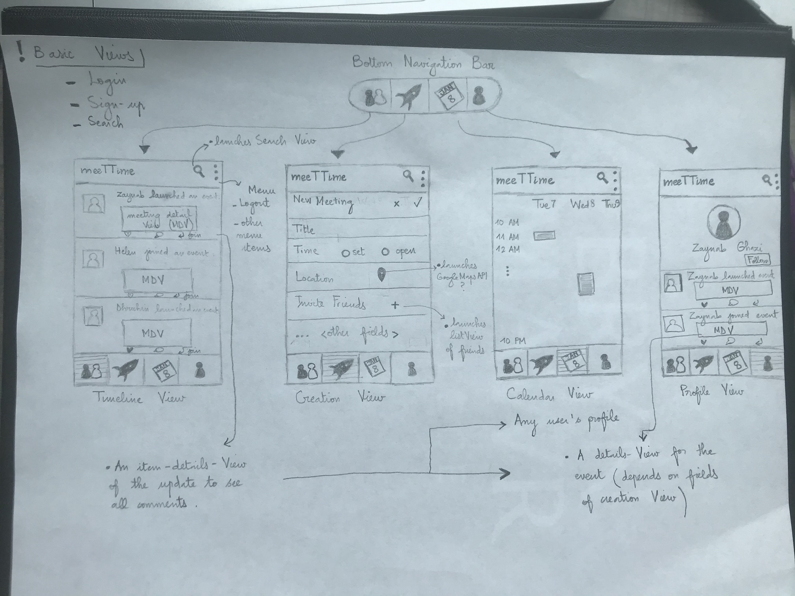

# meeTTime

## Table of Contents
1. [Overview](#Overview)
1. [Product Spec](#Product-Spec)
1. [Wireframes](#Wireframes)
2. [Schema](#Schema)

## Overview
### Description
This application allows users to schedule meetings with their friends. It mainly encourages real-life social interactions through offering users the option to 'join' events launched by their friends/family. 

### App Evaluation
- **Category:** Lifestyle/Utility
- **Mobile:** Portability
- **Story:** Encouraging real-life social interactions and meetings among friends and family.
- **Market:** All android users could use this app, especially not to fill their professional calendars with their casual appointments.
- **Habit:** A utility app. To be used when needed. It can be addictive in the sense that users will be curious to see what events their friends are joining ( assuming the timeline activity will display that information/ similar to VENMO's timeline).
- **Scope:** Feasible depending on the complexity of finding the time that works for all 'attendees'.

## Product Spec

### 1. User Stories (Required and Optional)

**Required Must-have Stories**

* User can login/sign-up.
* User can create a profile.
* User can launch an event.
    * User can chose to launch an 'open' meeting; i.e an algorithm will keep recalculating the closest time that works for all attendees every time another user joins the event.
* User can join a launched event.
* User can search for other users.
* User can view other users' profiles.
* User can follow other users.
* User has access to a stream screen of updates of all users they follow (ex: "Zaynab launched event x." |"Helen joined event Y.")
* User can edit their availability. 
  * There can be a calendar view to achieve this story.
  * I can use Google Calendar API to fetch availability data from user's g-calendar.
 * User can like updates/join events from their timeline.
* User can use camera to set/change profile picture or set/change event picture.


**Optional Nice-to-have Stories**

* Link to Uber API to automate ride requests? 
* Display notification to homescreen when it is time for the meeting?
* Use Google Calendar API to fill some availability setting + add events to google calendar?


### 2. Screen Archetypes

* Login Screen
   * User can login
 * Sign-up screen
   * User can sign-up
 * Profile creation/editing screen
    * User can edit their profile
    * Availability can also be edited from here
* Stream
   * User can view updates on other users (i.e user X joined/launched meeting...)
   * User can join meetings from stream (if allowed by launcher)
   * User can like an update
* Creation
   * User can launch a meeting
   * User can invite other users 
   * User customizes the settings for the meeting (i.e details of the event)
* Search
    * User can search for other users
    * User can follow other usesr
* Profile Screen
    * User can see own history of scheduling
    * User can see other users' history of scheduling
    * 
* Calendar
    * need for some API?
    * User can update calendar to edit availability and see meetings joined?
* Event description Screen
    * will include info regarding event launched including attendees, a text description, time, location and possibly a photo to satisfy FBU requirement.
Note: depending on how the following feature is implemented, a new screen for just requests to be accepted/rejected.
### 3. Navigation

**Tab Navigation** (Tab to Screen)

* HomeScreen (timeline)
* Launch a meeting
* Calendar
* Profile

**Flow Navigation** (Screen to Screen)

* Sign-up Screen
   * Login Screen
* Profile Screen
   * Event description screen(s)
* Timeline (Stream Screen)
   * own profile
   * other users'profiles
   * Event description screen
* Search Screen
   * other people's profiles
* Calendar Screen
    * Event description screen(s)
* Creation Screen
    * Timeline screen
    * profile screen?

** Notes:
* Need to figure out how to display follow requests (new screen?)

## Wireframes


## Schema 

### Models
**Default models:** User and Session.
**Customzie User by adding the following fields:**


| Property | Type |Description|
| -------- | -------- | -------- |
|firstName| String| First name of user|
|lastName| String| Last name of user|
| email    | String   | Email of user for more robust signup/login |
|photo| File|Profile picture of user|
|friends | Array of User Pointers| list of user's friends|


**Meeting_Post**


| Property | Type     | Description |
| -------- | -------- | -------- |
| objectId  | String   | unique id for the user post (default field) |
|owner|Pointer to User| user who launched/joined meeting|
|meeting| Pointer to Meeting| meeting that owner joined/launched|
|launched| Boolean| 1= launched; 0=joined|
|caption| String| meeting caption by owner|
|likesCount| Number | number of likes for the meeting_post|
|commentsCount| Number| number of comments on meeting_post|
|createdAt| DateTime| date when meeting_post is created (def. field)|
|updatedAt| DateTime| date when meeting_post was last updated (def. field)|

**Meeting**
| Property | Type     | Description |
| -------- | -------- | -------- |
| objectId  | String   | unique id for the meeting (default field) |
|title|String|Title of the meeting|
|open| Boolean | 1 = users can still join meeting|
|scheduled| Boolean| 1= time has been set|
|time|DateTime| date of meeting|
|located| Boolean| 1= location of meeting has been set|
|location| String| location of meeting -> should be compatible with googleMaps API OR URL to zoom call|
|inPerson| Boolean| 1=meeting is in person|
|chairperson|Pointer to User| user who launched meeting|
|description| String| description of meeting|
|attendees| Array of User Pointers|list of attendees|
|createdAt| DateTime| date when meeting is created (def. field)|
|updatedAt| DateTime| date when meeting was last updated (def. field)|

### Networking
**List of network requests by screen**
* Home feed screen/timeline
    * GET all meeting_posts where owner is user or friend of user
    ```java =
    ParseQuery<Meeting_Post>query=ParseQuery.getQuery(Meeting_Post.class);
    query.include(Meeting_Post.KEY_USER);
    query.include(Meeting_Post.KEY_MEETING);
    query.whereEqualTo(Meeting_Post.KEY_USER,ParseUser.getCurrentUser());
    query.whereContainedIn(Meeting_Post.KEY_USER, ParseUser.getCurrentUser().getList("friends"));
    query.addDescendingOrder(Meeting_Post.KEY_CREATEDAT);
        query.findInBackground(new FindCallback<Post>() {
            @Override
            public void done(List<Meeting_Post> posts, ParseException e) {
                if (e != null) {
                    Log.e(TAG, "Issue with getting posts.");
                    return;
                }
                for (Meeting_Post post : posts) {
                    Log.i(TAG, "Post: " + post.getDescription() + ", username: " + post.getUser().getUsername());
                }  
             }
        });
```
